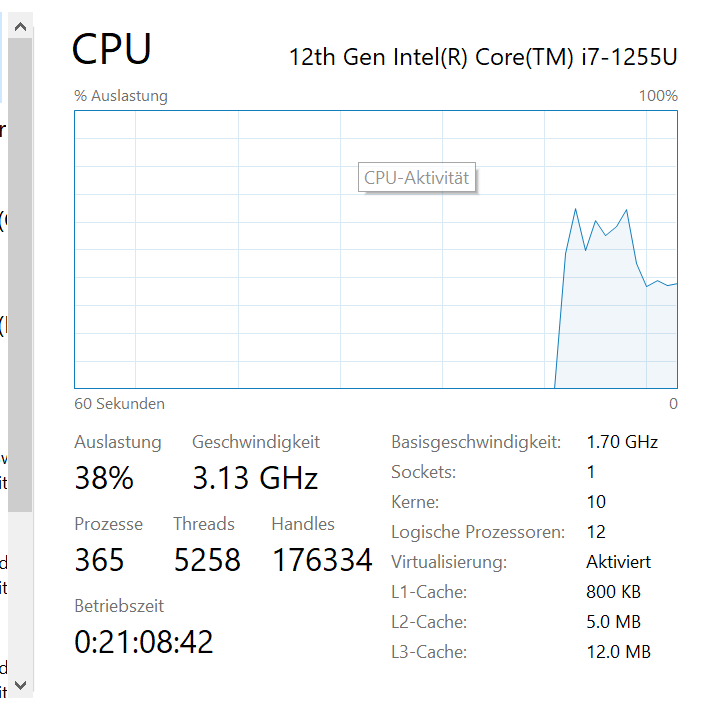
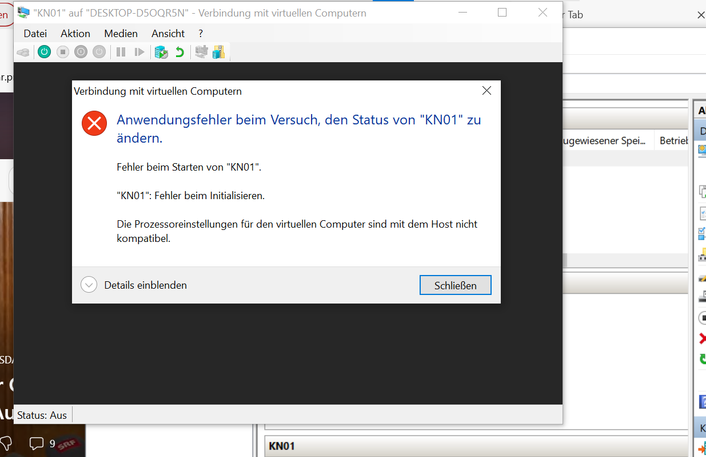
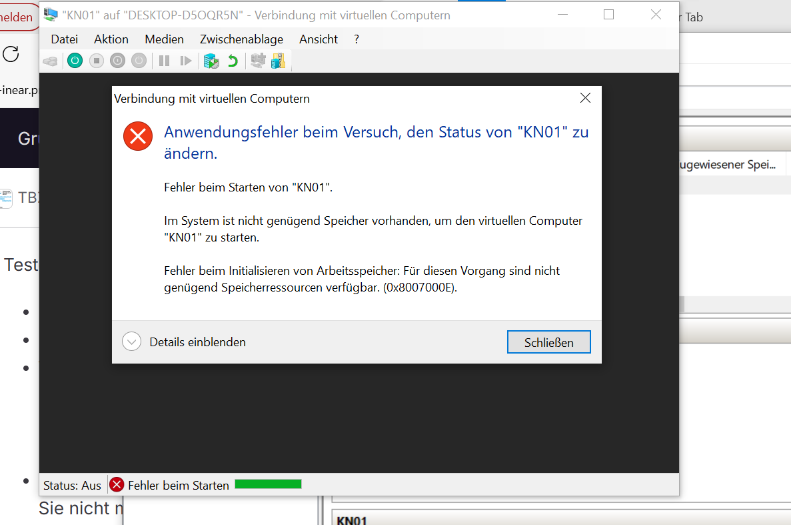

### Dokumentation

1. **Vermutung des Hypervisor Typs:**
   - Unsere Vermutung: Wir verwenden VMware Workstation, also einen Hypervisor Typ 2.

2. **Überprüfung der Ressourcen des Host-Systems:**
   - Host-System hat 4 logische Prozessoren und 8 GB RAM.
   - 
   - 

3. **Erstellen und Konfigurieren der VM:**
   - VM erstellt mit Ubuntu.
   - Versuch, 6 Prozessoren zuzuweisen und 10 GB RAM.
   - 
   - 

4. **Erklärung:**
   - **Fehlermeldung bei CPU-Zuweisung:** "Nicht genug logische Prozessoren."
   - **Fehlermeldung bei RAM-Zuweisung:** "Nicht genug verfügbarer Arbeitsspeicher."
   - **Erklärung:** Hypervisor Typ 2 nutzt die physische Hardware des Host-Systems und kann daher nicht mehr Prozessoren und RAM zuweisen, als physisch vorhanden sind. Dies liegt daran, dass ein Hypervisor Typ 2 als Anwendung auf einem bestehenden Betriebssystem läuft und daher an die physischen Ressourcen des Hosts gebunden ist.
   - **Bestätigung der Vermutung:** Unsere ursprüngliche Vermutung, dass es sich bei unserem System um einen Hypervisor Typ 2 handelt, wurde durch die erhaltenen Fehlermeldungen bestätigt.