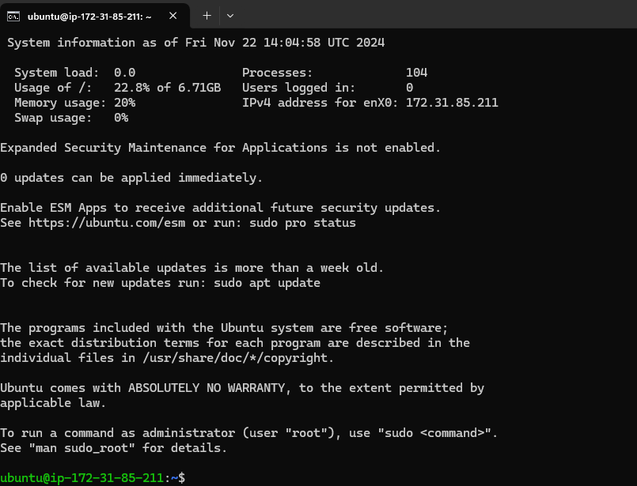
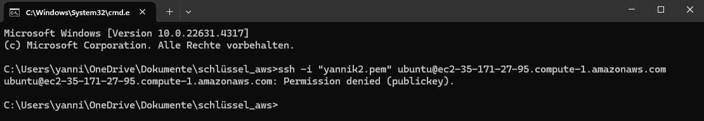

### Instanc verbinden

**Verwendung Key yannik1:** 

***Details:*** 
Die Sitzung zeigt die Systeminformationen des Ubuntu-Servers, einschließlich Systemlast, Speichernutzung, Swap-Nutzung und die Anzahl der laufenden Prozesse.
Die IP-Adresse des Servers (IPv4) ist 172.31.85.211.
Es wird darauf hingewiesen, dass die "Expanded Security Maintenance for Applications" nicht aktiviert ist und keine Updates sofort verfügbar sind.
Es wird empfohlen, sudo apt update auszuführen, um nach neuen Updates zu suchen.
Allgemeine Informationen und Haftungsausschluss zu den Programmen, die mit dem Ubuntu-System geliefert werden. 

**Verwendung Key yannik2:** 

***Details:*** 
Der Benutzer versucht, sich mit dem SSH-Befehl ssh -i "yannik2.pem" ubuntu@ec2-35-171-27-95.compute-1.amazonaws.com auf einem EC2-Server anzumelden.
Der Versuch schlägt fehl mit der Fehlermeldung „Permission denied (publickey)“.
Diese Fehlermeldung deutet darauf hin, dass die Authentifizierung mit dem angegebenen SSH-Schlüssel (yannik2.pem) nicht erfolgreich war. Mögliche Gründe könnten sein, dass der öffentliche Schlüssel nicht auf dem Server hinterlegt ist oder der verwendete Schlüssel falsch konfiguriert ist. 
>

