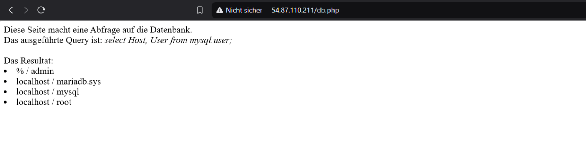
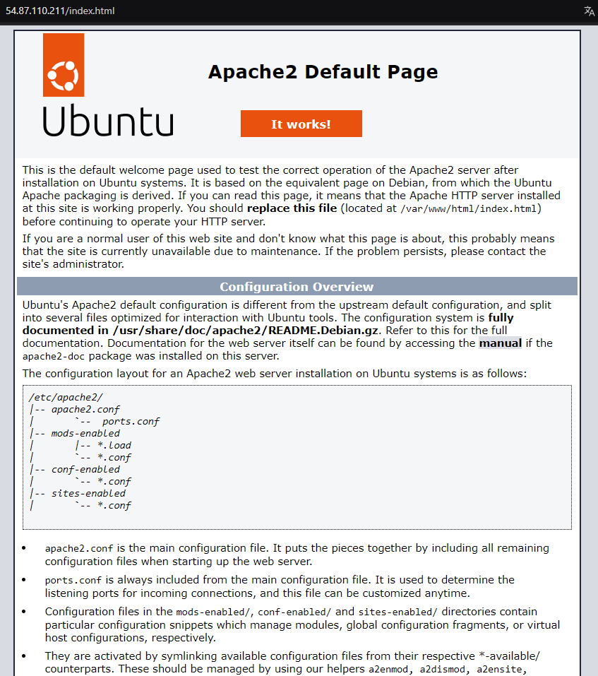
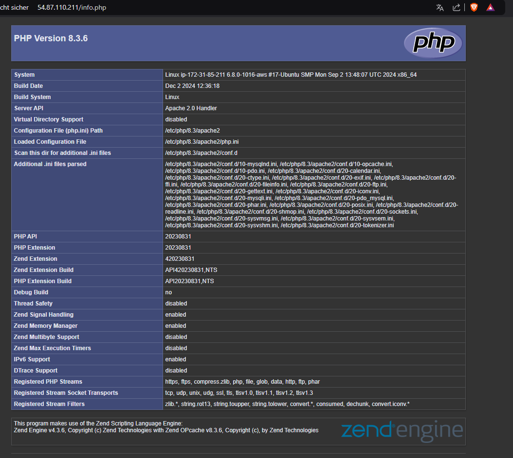
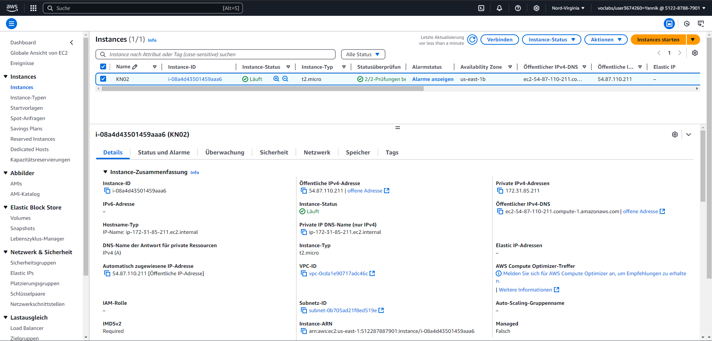
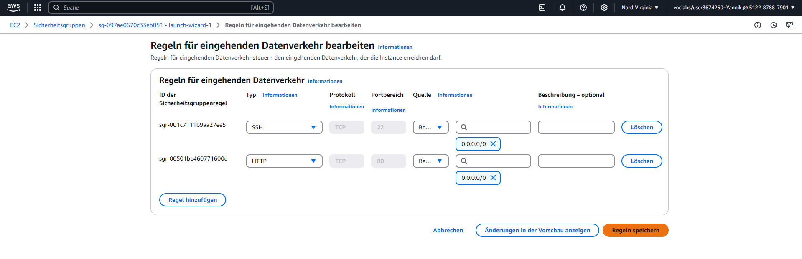
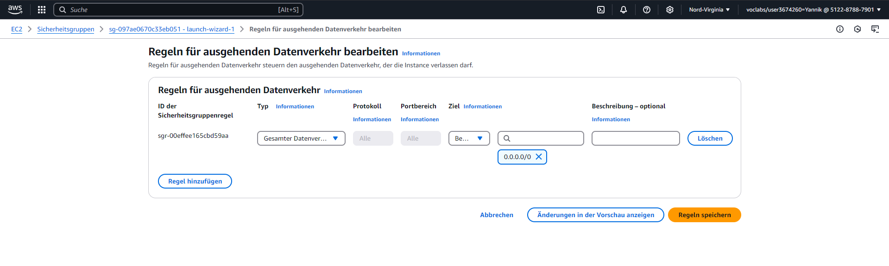
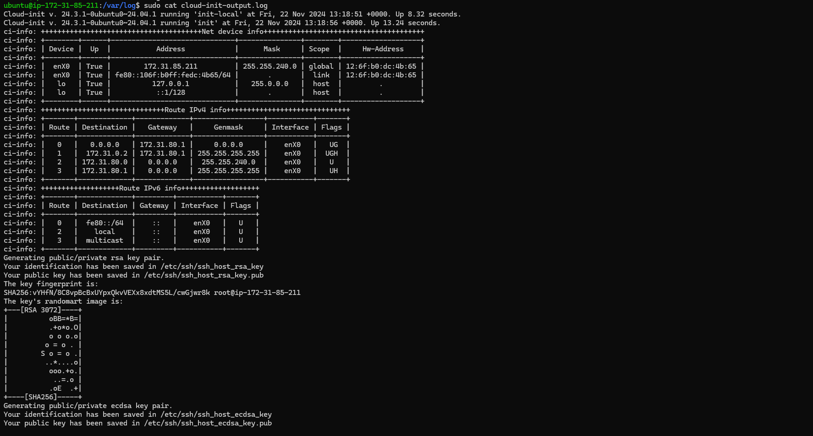
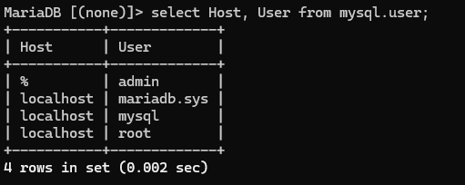

**DB** 
[db](http://http://54.87.110.211/db.php)

**Apache Server** 
[apache](http://54.87.110.211/index.html)

**php (von Apache Server geleitet)** 
[info](http://54.87.110.211/info.php)

**Details der Instanz**

 
**Regeln für eingehenden Datenverkehr**

 
**Ausgehende Regeln**

 
**Screnshot mit dem Auszug aus dem Cloud-Init-Login**

**MariaDB login**
 
Select Login zeigt mir alle Hosts an und die User die es hat

