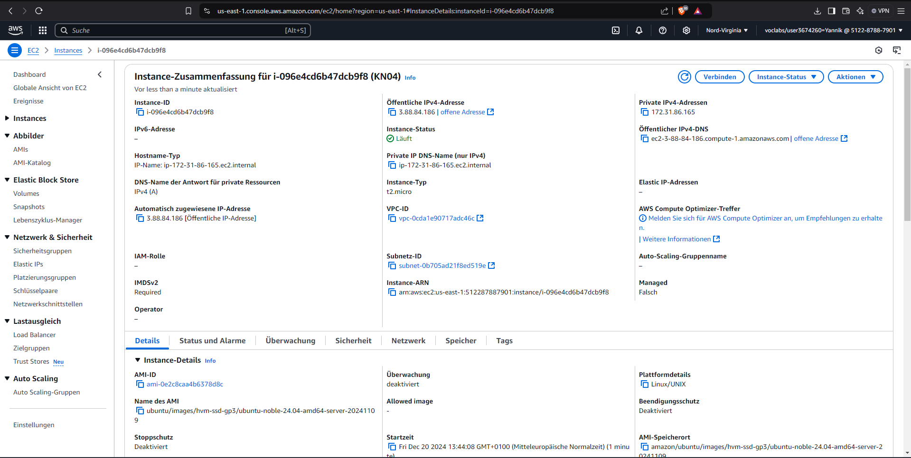
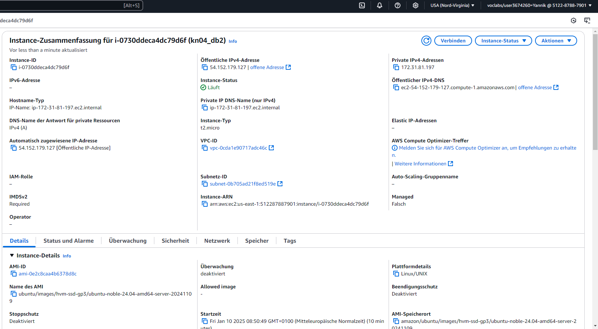
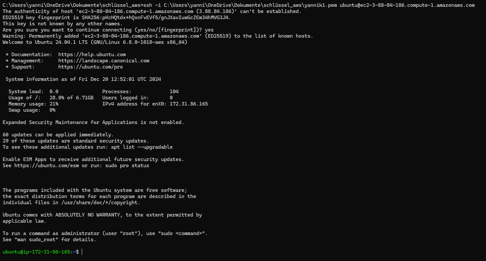
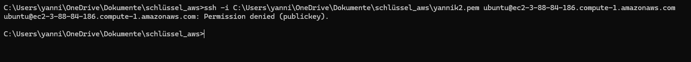
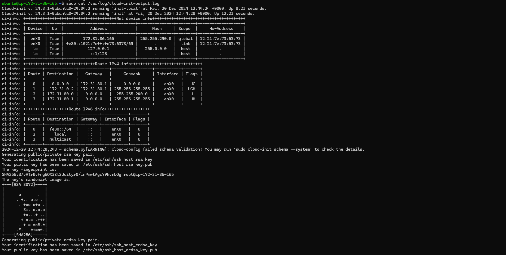
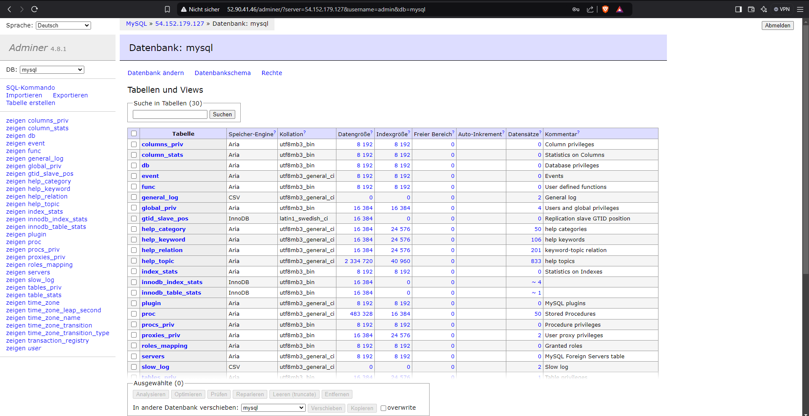

## Screenshots 

KN04 Instanz

KN04 Web Instanz

Kn04 db Instanz

Detailansicht meiner neu erstellten Instanz.

Hier wird per SSH mit einem privaten Schlüssel auf eine AWS EC2-Instanz zugegriffen und man ist nun als Benutzer ubuntu auf dem Server angemeldet.

Hier wird genau das gleiche gemacht, einfach mit dem nicht angegebenen Key, was dazu führt, dass dieser nicht auf die AWS EC2-Instanz zugreifen kann.
 

 Ausgabe nach dem Aufruf des "/var/log/cloud-init-output.log" Verzeichnises.

 
Screenshot meines apMiners

 
