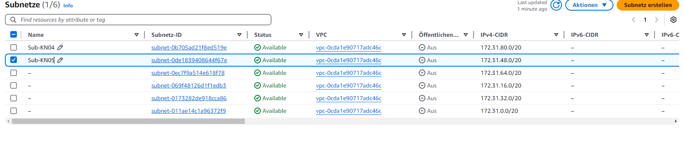
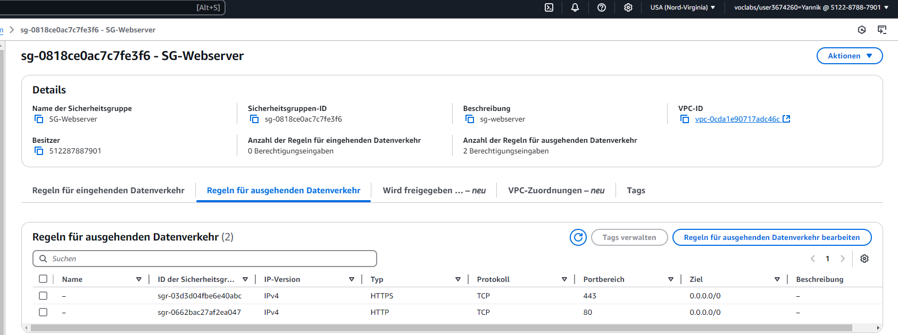
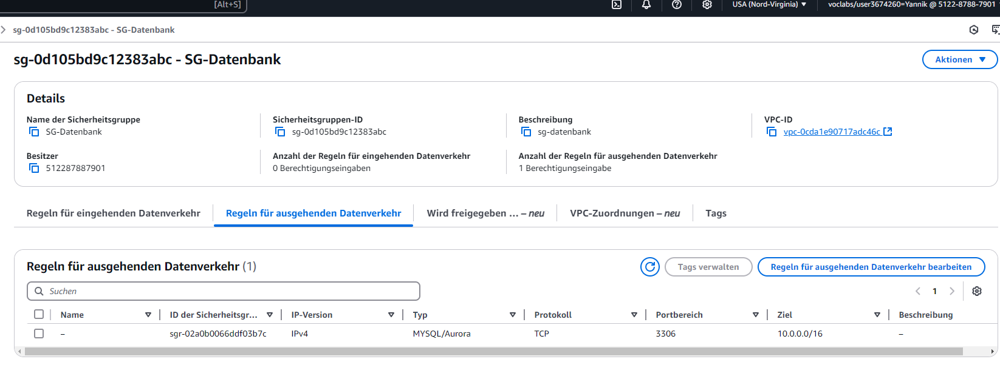
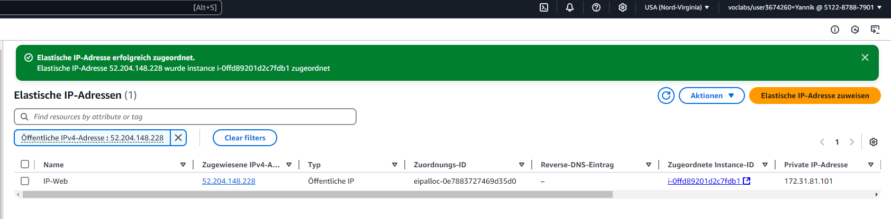
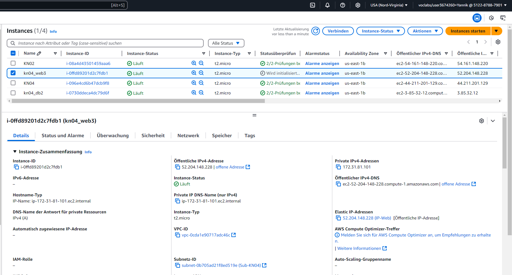
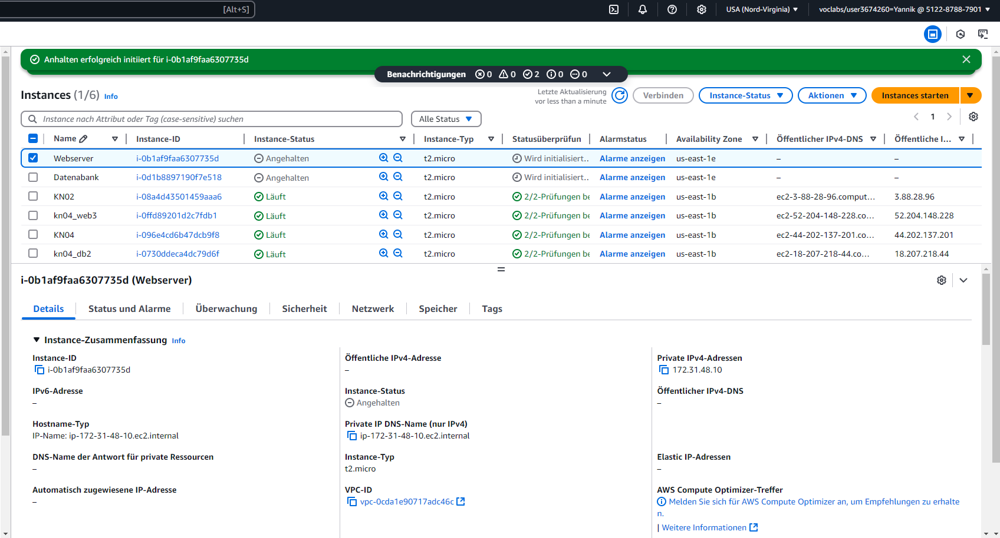
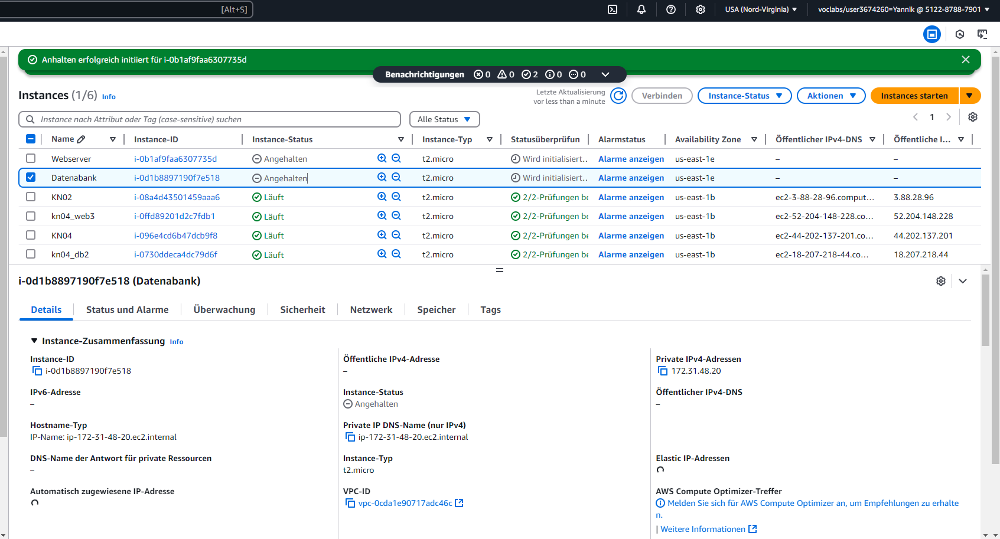
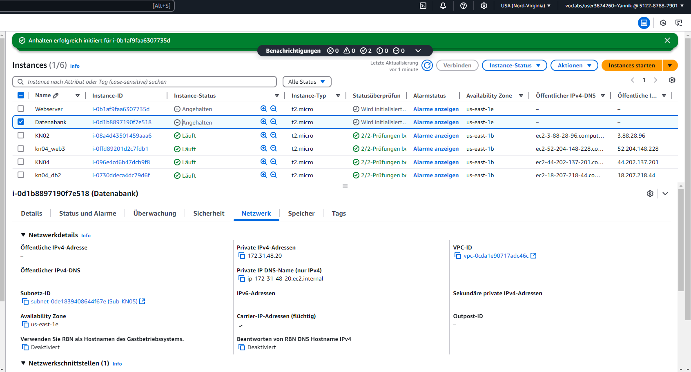

# Begriffe: VPC, Subnetz, public IP, private IP und static IP

## 1. Virtual Private Cloud (VPC)
- Eine **VPC** ist ein isoliertes, privates Netzwerk in der Cloud, das Sie konfigurieren können.
- Sie bietet eine sichere Umgebung für Ihre Ressourcen, indem Sie IP-Adressbereiche, Subnetze, Routing-Tabellen und Netzwerk-Gateways definieren.
- VPCs ermöglichen Ihnen, Ihre Infrastruktur sicher und unabhängig von anderen Nutzern in der Cloud zu betreiben.

---

## 2. Subnetz (Subnet)
- Ein **Subnetz** ist ein logischer Teilbereich innerhalb eines VPCs.
- Es teilt den IP-Adressbereich des VPCs in kleinere Segmente auf, um Ressourcen besser zu organisieren und zu verwalten.
- Subnetze können zwei Typen haben:
  - **Private Subnets**: Nicht direkt aus dem Internet erreichbar.
  - **Public Subnets**: Ressourcen sind über das Internet erreichbar, da sie mit einem Internet-Gateway verbunden sind.
- Ein Subnetz hat immer einen **CIDR-Block**, der den Adressbereich angibt (z. B. `10.0.1.0/24`).

---

## 3. Public IP
- Eine **Public IP-Adresse** ist eine weltweit eindeutige Adresse, die im Internet erreichbar ist.
- Sie wird verwendet, um Instanzen oder Dienste aus dem öffentlichen Internet zugänglich zu machen.
- Beispiele:
  - Webserver, die von Benutzern im Internet aufgerufen werden sollen.
  - APIs oder Anwendungen, die externen Zugriff benötigen.

---

## 4. Private IP
- Eine **Private IP-Adresse** ist eine interne Adresse, die nur innerhalb des VPCs oder eines lokalen Netzwerks erreichbar ist.
- Sie ermöglicht die Kommunikation zwischen Ressourcen, ohne dass sie direkt aus dem Internet zugänglich sind.
- Beispiele:
  - Datenbankserver, die nur von einer Anwendung im selben VPC genutzt werden.
  - Interne Server für Backups oder Dienste.

---

## 5. Statische IP
- Eine **statische IP-Adresse** ist eine feste IP-Adresse, die dauerhaft einer Ressource zugeordnet wird.
- Sie ändert sich nicht, selbst wenn die Instanz neu gestartet wird.
- Verwendung:
  - Für Anwendungen oder Dienste, bei denen eine konsistente IP-Adresse erforderlich ist (z. B. DNS-Einträge oder Firewall-Regeln).
- Beispiel:
  - Elastic IP in AWS: Eine spezielle Art von statischer IP, die öffentlich erreichbar ist.

## Screensshot Subnetzliste

## Neu definierte IP's
- **Sub-KN04**: 172.31.80.10
- **Sub-KN05**: 172.31.48.20

## Screensshot Sicherheitsgruppen
### Sicherheitsgruppe SG-Webserver

### Sicherheitsgruppe SG-Datenbank

## Screensshot Elastic IP
### Liste der Elastischen IP's

### Instanz mit der verbundebeb Elastischen IP

## Screensshot Instanzen
### Gestoppte Instanzen
Gestoppte Web-Instanz

Gestoppte DB-Instanz

### Instanzen mit SubnetzID
Web-Instanz mit SubnetzID

DB-Instanz mit SubnetzID

