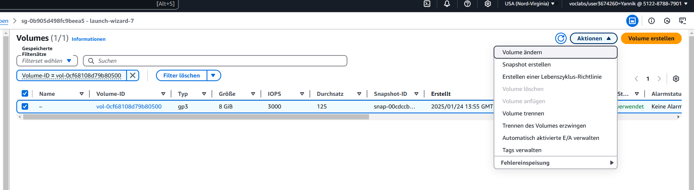

# Reverse Proxy und Cloud-Init

## Reverse Proxy - Erklärung in eigenen Worten

Ein **Reverse Proxy** ist ein Server, der Anfragen von Clients entgegennimmt und diese an einen oder mehrere Backend-Server weiterleitet. Dabei verbirgt der Reverse Proxy die tatsächliche Infrastruktur hinter sich. Er agiert quasi als Mittelsmann zwischen dem Client (z.B. Webbrowser) und dem Backend (z.B. Webanwendung, API). Häufig wird ein Reverse Proxy genutzt, um Lasten zu verteilen, Sicherheit zu erhöhen oder um eine zentralisierte Verwaltung von APIs zu ermöglichen.

---

## Screenshot der Swagger-URL

---

## Screenshot der Aufruf des Endpoints `products` (Java) bzw. `respGetProducts` (.NET) via Swagger

---

## Screenshot einer MongoDB Collection mit Auszug aus dem Inhalt

---

## Cloud-Init - Analyse der Inhalte für eine produktive Umgebung

In einer produktiven Umgebung machen einige Teile des Cloud-Init-Skripts wenig Sinn oder sind sogar unsicher. Beispielsweise:

- **Sicherheitsrelevante Daten wie Passwörter im Klartext**: Es ist unüblich, Passwörter direkt in Cloud-Init-Konfigurationen zu hinterlegen, da dies zu einem Sicherheitsrisiko führen kann.
- **Verwendung von standardisierten SSH-Schlüsseln**: In einer produktiven Umgebung sollte jeder Server seinen eigenen SSH-Schlüssel haben, um ein erhöhtes Sicherheitsniveau zu gewährleisten.

## Volumen vergrössern
### Schritt 1

### Schritt 2

### Schritt 3

### Schritt 4

### Schritt 5

### Schritt 6

# Was ist ein DNS?

Das **Domain Name System (DNS)** ist wie ein Telefonbuch für das Internet. Es übersetzt **Domainnamen** (z.B. `www.example.com`) in **IP-Adressen** (z.B. `192.168.1.1`), die von Computern verwendet werden, um sich miteinander zu verbinden.

## Funktionsweise

1. **Namensauflösung**:
   - Wenn du eine URL (z.B. `www.example.com`) in deinen Browser eingibst, fragt dein Computer den DNS-Server nach der zugehörigen **IP-Adresse**.
   - Der DNS-Server gibt dann die IP-Adresse zurück, damit der Browser weiß, zu welchem Server er sich verbinden muss.

2. **DNS-Server**:
   - Ein **DNS-Server** ist ein spezieller Server, der diese Übersetzungen vornimmt. Es gibt viele DNS-Server, die hierarchisch miteinander arbeiten.
   - Wenn ein DNS-Server die IP-Adresse für eine Domain nicht kennt, fragt er andere Server an, bis er die Antwort erhält.

3. **Verwendung von DNS**:
   - **Beispiel**: Du gibst `www.example.com` ein.
     - Der DNS-Server findet heraus, dass die IP-Adresse für `www.example.com` z.B. `93.184.216.34` ist.
     - Dein Computer kann dann mit dem Server unter dieser IP-Adresse kommunizieren, um die Website zu laden.

## Warum ist DNS wichtig?

- **Benutzerfreundlichkeit**: Ohne DNS müssten wir uns IP-Adressen merken, was äußerst unpraktisch wäre.
- **Skalierbarkeit**: DNS hilft dabei, große Netzwerke und Internetdienste zu verwalten, indem es den Verkehr auf verschiedene Server verteilt.
- **Redundanz**: DNS-Systeme sind so aufgebaut, dass sie auch dann funktionieren, wenn ein Server ausfällt, indem sie alternative Server oder IP-Adressen bereitstellen.

## Zusammengefasst

- DNS übersetzt **Domainnamen** in **IP-Adressen**, damit Computer wissen, wie sie sich miteinander verbinden.
- Es stellt sicher, dass du Websites über einfache Namen wie `www.example.com` statt über komplizierte IP-Adressen erreichen kannst.
- DNS ist ein entscheidender Bestandteil des Internets und sorgt dafür, dass alles reibungslos läuft.

### Swagger-Aufrufs über die LoadBalancer URL

