# Kostenvergleich

## Infrastructure-as-a-Service (IaaS)

### Microsoft Azure
### Web Server
- **Virtual Machine**: B1ms

  - 1 Core, 2 GB RAM, Ubuntu
  - Temporärer Speicher: 4 GB
  - Kosten: $10.60/Monat
- **Zusätzlicher Speicher**:
  - 32 GB Standard HDD (S4)
  - Kosten: $1.69/Monat
- **Add-ons**:
  - Logging und Monitoring: $10.00/Monat
- **Gesamtkosten Web Server**: $22.29/Monat
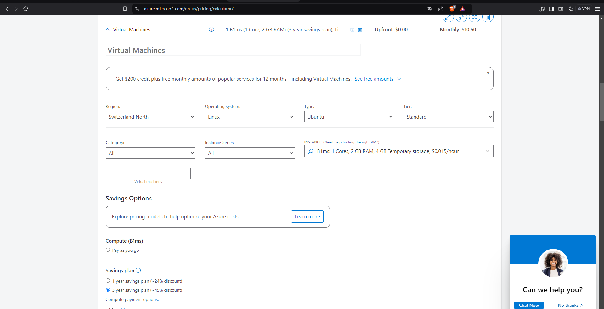
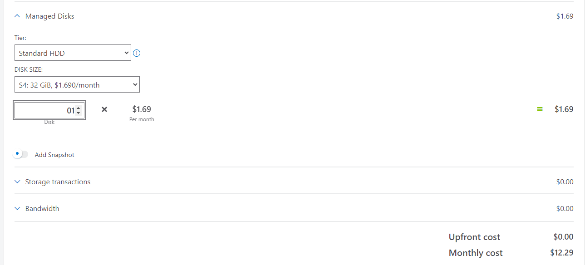

---
### Datenbank Server
- **Virtual Machine**: B2ms
  - 2 Cores, 8 GB RAM, Ubuntu
  - Temporärer Speicher: 16 GB
  - Kosten: $44.09/Monat
- **Zusätzlicher Speicher**:
  - 100 GB Standard HDD (S4)
  - Kosten: $5.28/Monat
- **Add-ons**:
  - Logging und Monitoring: $10.00/Monat
- **Gesamtkosten DB Server**: $59.37/Monat
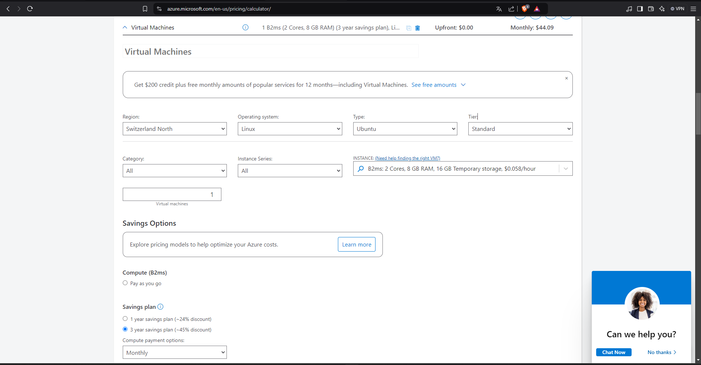
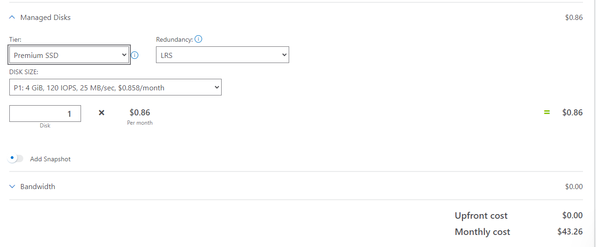
---
### Backup-Speicher
- **Block Blob Storage**:
  - 1000 GB
  - Redundanz: LRS
  - Kosten: $20.80/Monat
- **Add-ons**:
  - Zusätzliche Snapshots: $10.00/Monat
- **Gesamtkosten Backup-Speicher**: $30.80/Monat
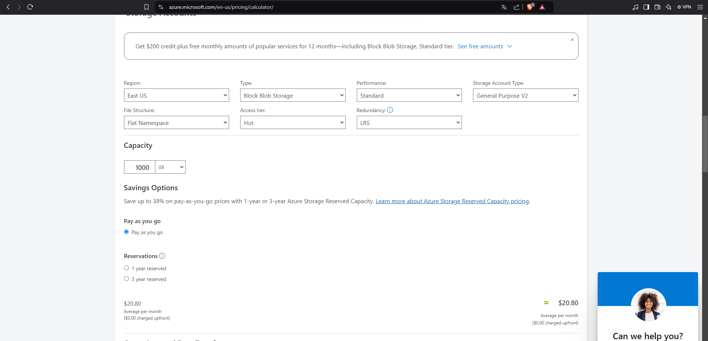

---
## **Kostenübersicht (Monatlich)**
- **Webserver**: $22.29
- **WebsDatenbank-Server**: $59.37
- **Logging und Monitoring**: $30.80  
- **Gesamt**: $112.46

---
### Amazon Web Services
### Webserver
- **Instance**: t3.small
  - **vCPU**: 2 
  - **RAM**: 2 GB 
  - **Betriebssystem**: Ubuntu 
  - **Speicher**: EBS General Purpose SSD 
  - **Kosten**: $12.99/Monat 
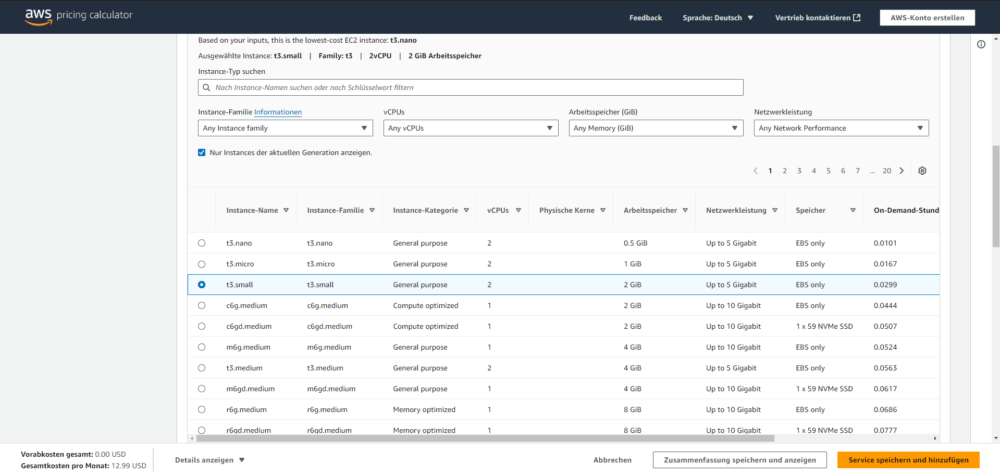
---
### Datenbank-Server
- **Instance**: t3.medium
  - **vCPU**: 2 
  - **RAM**: 4 GB 
  - **Betriebssystem**: Ubuntu 
  - **Speicher**: EBS General Purpose SSD mit 100 GB 
  - **Kosten**: $193.99/Monat 
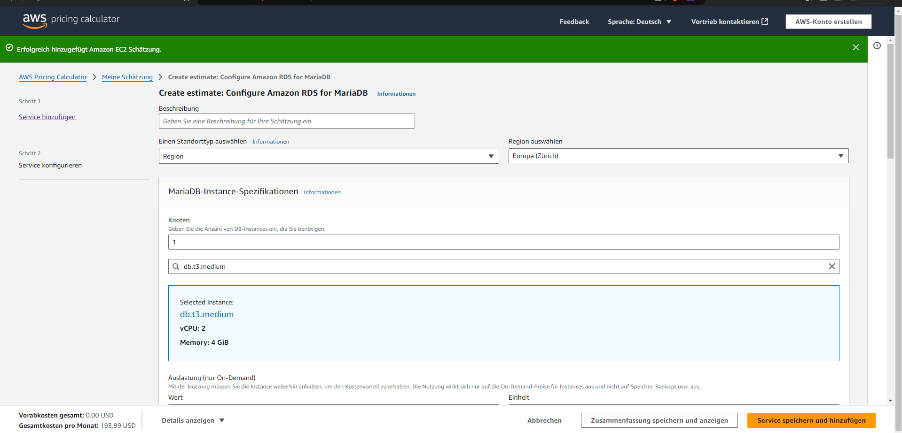
---
### Backup-Speicher
- **Amazon S3 Standard**:
  - **Speicherplatz**: 1.4 TB 
  - **PUT- und GET-Anfragen**: Monatlich geschätzt, basierend auf Backup-Zyklen. 
  - **Kosten**: $32.20/Monat 
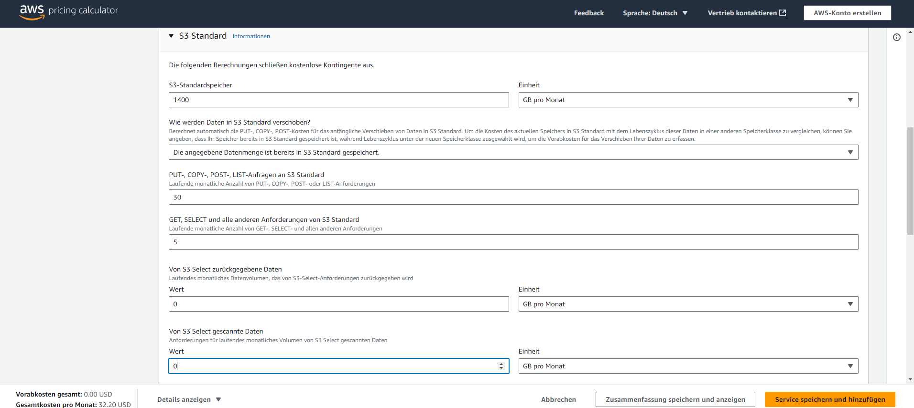
---

## **Kostenübersicht (Monatlich)**
- **Webserver**: $12.99
- **Datenbank-Server**: $193.99 
- **Backup-Speicher**: $32.20   
- **Gesamt:** $239.18

## Auswahl und Abweichungen der IaaS-Komponenten

## **Microsoft Azure**

### **Webserver**
**Auswahl:**
- Der **B1ms-VM-Typ** wurde gewählt, da er für leichte bis mittelschwere Webserver-Workloads ausreichend ist.  
- **Ressourcen**: 1 Core und 2 GB RAM, ideal für statische oder weniger anspruchsvolle dynamische Websites.  
- **Speicher**:  
  - Temporärer Speicher (4 GB).  
  - Zusätzlicher Speicher (32 GB Standard HDD), geeignet für Webserver-Dateien, Logs und das Betriebssystem.  
- **Add-ons**: Logging und Monitoring, um die Performance zu überwachen und Fehler schnell zu erkennen.  

**Abweichungen zu On-Premise:**
- On-Premise-Infrastrukturen setzen oft auf dedizierte physische Server mit redundanter Hardware.  
- Virtual Machines in der Cloud sind hingegen flexibel skalierbar und kostengünstiger.  
- Die Wahl von HDD (statt SSD) basiert auf begrenzten Lese-/Schreib-Anforderungen und reduziert die Kosten.

---

### **Datenbank-Server**
**Auswahl:**
- Der **B2ms-VM-Typ** (2 Cores, 8 GB RAM) bietet ausreichende Leistung für kleine bis mittelgrosse relationale Datenbanken wie MySQL oder PostgreSQL.  
- **Speicher**:  
  - Temporärer Speicher (16 GB).  
  - Zusätzlicher Speicher (100 GB Standard HDD), passend für typische Datenbankanwendungen.  
- **Add-ons**: Logging und Monitoring helfen bei der Verwaltung von Query-Performance und Datenbankintegrität.  

**Abweichungen zu On-Premise:**
- On-Premise-Datenbanken würden auf spezialisierten Servern mit leistungsstarker Hardware und RAID für Ausfallsicherheit laufen.  
- In der Azure-Umgebung stellt die Plattform Datenintegrität und Ausfallsicherheit durch native Services sicher, wodurch RAID-Level überflüssig werden.

---

### **Backup-Speicher**
**Auswahl:**
- **Block Blob Storage** mit 1 TB Kapazität und LRS-Redundanz (Local Redundant Storage) wurde gewählt, um kosteneffizienten, aber sicheren Speicherplatz für Backups bereitzustellen.  
- **Zusätzliche Snapshots** erhöhen die Wiederherstellungsoptionen und stellen sicher, dass bei einem Vorfall aktuelle Daten verfügbar sind.  

**Abweichungen zu On-Premise:**
- On-Premise-Backups verwenden oft Bandlaufwerke oder NAS-Systeme, kombiniert mit lokalen und Offsite-Kopien.  
- Cloud-Backups bieten mehr Flexibilität und geringeren Verwaltungsaufwand, jedoch potenziell höhere Latenzzeiten bei der Wiederherstellung grosser Datenmengen.

---

### **Kostenübersicht und Vorteile**
- **Gesamtkosten**: $112.46/Monat.  
- Azure bietet kosteneffiziente Ressourcen für die genannten Workloads.  
- **Vorteile**: Flexibilität und Skalierbarkeit ermöglichen Anpassungen an zukünftige Anforderungen ohne zusätzliche Hardware.

---

## **Amazon Web Services (AWS)**

### **Webserver**
**Auswahl:**
- Die **t3.small-Instanz** bietet mit 2 vCPUs und 2 GB RAM mehr Rechenkapazität als der Azure-Webserver.  
- Diese Auswahl ist ideal für rechenintensive Webanwendungen.

**Abweichungen zu On-Premise:**
- AWS setzt wie Azure auf Virtualisierung statt dedizierter physischer Server.  
- **Speicher**: EBS General Purpose SSD ermöglicht schnellere Speicherzugriffe, die in On-Premise-Umgebungen durch SSD-Arrays realisiert würden.

---

### **Datenbank-Server**
**Auswahl:**
- Die **t3.medium-Instanz** (2 vCPUs, 4 GB RAM) bietet eine solide Leistung für kleine bis mittelgrosse Datenbanken.  
- **Speicher**: EBS General Purpose SSD mit 100 GB, geeignet für hohe IOPS-Anforderungen.  

**Abweichungen zu On-Premise:**
- AWS bietet standardmässig redundanten und leicht skalierbaren Speicher.  
- On-Premise-Lösungen erfordern zusätzliche Hardware und RAID-Konfigurationen, um die gleiche Ausfallsicherheit zu gewährleisten.

---

### **Backup-Speicher**
**Auswahl:**
- **Amazon S3 Standard** wurde gewählt, da es eine robuste und skalierbare Lösung für Backups bietet.  
- **Kapazität**: 1.4 TB, entsprechend einer grösseren Datenmenge und häufigeren PUT-/GET-Anfragen.  

**Abweichungen zu On-Premise:**
- On-Premise-Backups erfordern dedizierte Hardware wie NAS oder Bandlaufwerke, die initial hohe Kosten verursachen.  
- AWS bietet sofortige Erweiterbarkeit und einfachere Wiederherstellungsmöglichkeiten.

---

### **Kostenübersicht und Vorteile**
- **Gesamtkosten**: $239.18/Monat.  
- AWS bietet höhere Leistung und bessere Speicheroptionen, ist jedoch teurer als Azure.  
- Diese Lösung eignet sich besonders für Anwendungen mit hohem Leistungsbedarf oder spezifischen Anforderungen an den Speicherzugriff.

---

## **Fazit**
- **Azure** ist eine kosteneffiziente Lösung ($112.46/Monat) für leichte bis mittelschwere Workloads.  
- **AWS** ist teurer ($239.18/Monat), bietet jedoch bessere Performance und Speicherlösungen für anspruchsvollere Anforderungen.  
- Beide Cloud-Optionen minimieren den Verwaltungsaufwand und bieten integrierte Sicherheits- und Monitoring-Tools, die bei einer On-Premise-Infrastruktur manuell eingerichtet werden müssten.

## Platform-as-a-Service (PaaS)
### Webserver

- **On-Premise-Anforderung**: 1 Core, 2 GB RAM, 20 GB Speicher.
- **Preis max. $50 / Monat**
- **Heroku-Auswahl**: **Standard-Tarif für Web-Apps**.

  - **Warum?**:

    - Erfüllt die Anforderungen mit 512 MB bis 1 GB RAM und skalierbaren CPU-Ressourcen.

    - Unterstützt einfache Skalierung bei steigender Last.

    - Updates ohne Ausfallzeiten dank Zero-Downtime-Deployments.

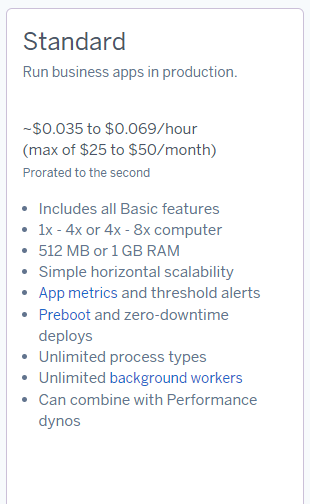 
---
### Datenbankserver

- **On-Premise-Anforderung**: 2 Cores, 4 GB RAM, 100 GB Speicher.
- **Preis max. $50 / Monat**
- **Heroku-Auswahl**: **Standard-Tarif für Datenbanken**.

  - **Warum?**:

    - Startet mit 4 GB RAM und 64 GB Speicher, erweiterbar bis 768 GB RAM und 4 TB Speicher.

    - Unterstützt ausreichend Verbindungen für 30 Benutzer.

    - Automatische Backups und integrierte Sicherheitsfunktionen wie Encryption-at-Rest.

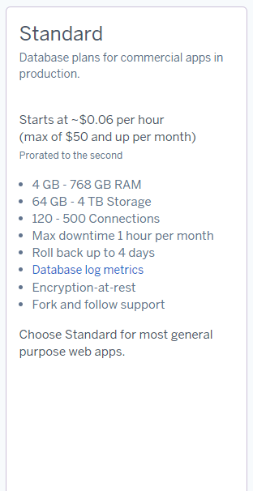
---
### Backup-Speicher

- **On-Premise-Anforderung**: Tägliche, wöchentliche und monatliche Backups.
- **Preis ind Dattenbankkosten enthalten.**
- **Heroku-Auswahl**: **Backup-Funktion der Datenbank**.

  - **Warum?**:

    - Automatische Erstellung von Backups.

    - Für längere Aufbewahrungszeiten kann zusätzlicher Speicher wie AWS S3 genutzt werden.
---
## **Kostenübersicht (Monatlich)**
- **Webserver**: $50
- **WebsDatenbank-Server**: $50
- **Logging und Monitoring**: $10  
- **Gesamt**: $110

## Erklärung der Auswahl der Komponenten

Die Auswahl der Heroku-Plattform für die PaaS-Infrastruktur basiert auf verschiedenen Überlegungen, um die Anforderungen des Systems zu erfüllen, während die Flexibilität, Skalierbarkeit und Kosteneffizienz beibehalten wird. Dabei wurde jeweils darauf geachtet, die On-Premise-Anforderungen zu berücksichtigen, aber auch die Vorteile von Heroku zu nutzen, die in bestimmten Bereichen über die traditionelle On-Premise-Infrastruktur hinausgehen.

### 1. **Webserver**

**On-Premise-Anforderungen:**
- **1 Core, 2 GB RAM, 20 GB Speicher**.
- **Maximaler Preis: $50/Monat**.

**Heroku-Auswahl:** **Standard-Tarif für Web-Apps**.

- **Abweichungen:**
  - Der Standard-Tarif von Heroku bietet zwischen **512 MB und 1 GB RAM**, was etwas weniger ist als die On-Premise-Anforderung von 2 GB RAM. Dies wurde jedoch als akzeptabel erachtet, da die Skalierbarkeit von Heroku es ermöglicht, die Ressourcen bei steigender Last zu erweitern. Bei Bedarf kann Heroku mehr Ressourcen dynamisch zuweisen, um den Anforderungen gerecht zu werden.
  - **Skalierbarkeit**: Der Web-Server auf Heroku kann leicht horizontal skaliert werden, d.h., mehr Instanzen können hinzugefügt werden, wenn die Last steigt, was in einer On-Premise-Infrastruktur schwierig zu erreichen und teurer wäre.
  - **Zero-Downtime-Deployments**: Eine wichtige Funktion von Heroku ist die Fähigkeit, Updates ohne Ausfallzeiten durchzuführen. Diese Flexibilität ist in einer On-Premise-Lösung oft schwieriger umzusetzen, da regelmässige manuelle Eingriffe erforderlich sind.
  
  **Warum diese Wahl?**
  - **Flexibilität und Skalierbarkeit**: Heroku bietet eine sehr gute Möglichkeit, bei steigender Nachfrage mehr Ressourcen zu allocieren, was den statischen 1-Core und 2-GB-RAM-Anforderungen der On-Premise-Infrastruktur überschreiten kann, aber für kleine Anwendungen mehr als ausreichend ist.
  - **Kosteneffizienz**: Der Preis von $50 pro Monat passt zum Budget und ermöglicht eine leistungsfähige Lösung, ohne in zusätzliche Hardware und Verwaltung investieren zu müssen.

---

### 2. **Datenbankserver**

**On-Premise-Anforderungen:**
- **2 Cores, 4 GB RAM, 100 GB Speicher**.
- **Maximaler Preis: $50/Monat**.

**Heroku-Auswahl:** **Standard-Tarif für Datenbanken**.

- **Abweichungen:**
  - Der **Heroku Standard-Tarif** beginnt mit **4 GB RAM und 64 GB Speicher**, was in erster Linie mehr Speicher als die On-Premise-Anforderungen von 100 GB bietet. Das Modell ermöglicht es jedoch, bei Bedarf problemlos auf grössere Kapazitäten (bis zu 768 GB RAM und 4 TB Speicher) zu skalieren.
  - **Mehr Speicher**: Heroku bietet mit seinen Datenbanklösungen bereits ausreichend Platz für 30 Benutzer und lässt sich einfach erweitern, was in einer On-Premise-Infrastruktur eine zusätzliche Investition in Hardware und Zeit zur Skalierung bedeutet.
  - **Automatische Backups** und **Sicherheitsfunktionen** wie **Encryption-at-Rest** bieten zusätzliche Sicherheitsvorteile, die bei einer traditionellen On-Premise-Infrastruktur in der Regel manuell implementiert werden müssten.

  **Warum diese Wahl?**
  - **Skalierbarkeit und Zukunftssicherheit**: Die Heroku-Datenbanklösung bietet von Anfang an mehr Kapazität und die Möglichkeit, bei steigendem Bedarf problemlos auf eine grössere Instanz zu wechseln.
  - **Sicherheitsfeatures**: Heroku bietet integrierte Sicherheitsfunktionen, die die On-Premise-Lösung übertreffen könnten, insbesondere in Bezug auf Datenverschlüsselung und automatische Backups. Dies reduziert die Notwendigkeit für zusätzliche Sicherheitsmassnahmen und manuelle Backups.
  - **Kosteneffizienz**: Die monatlichen Kosten von bis zu $50 bleiben mit den erweiterten Ressourcen immer noch im Rahmen und bieten ein gutes Preis-Leistungs-Verhältnis, insbesondere wenn man die zusätzliche Verwaltungs- und Hardwareanforderung bei einer On-Premise-Lösung berücksichtigt.

---

### 3. **Backup-Speicher**

**On-Premise-Anforderungen:**
- **Tägliche, wöchentliche und monatliche Backups**.
- **Preis ist in den Datenbankkosten enthalten.**

**Heroku-Auswahl:** **Backup-Funktion der Datenbank**.

- **Abweichungen:**
  - **Automatische Backups** sind bei Heroku standardmässig enthalten, was in einer On-Premise-Umgebung durch manuelle Backups oder zusätzliche Backup-Systeme ersetzt werden müsste.
  - **Längerfristige Aufbewahrung**: Wenn zusätzliche Aufbewahrung notwendig ist, kann zusätzlicher Speicher wie **AWS S3** verwendet werden, um grosse Mengen an Daten über längere Zeiträume zu sichern. Dies ist eine skalierbare Lösung, die in einer On-Premise-Infrastruktur nur mit zusätzlicher Hardware und Ressourcen erreicht werden kann.

  **Warum diese Wahl?**
  - **Automatisierung und Redundanz**: Die automatische Backup-Funktion von Heroku vereinfacht den Prozess erheblich, sodass keine zusätzlichen Ressourcen für die Verwaltung der Backups benötigt werden. Dies stellt sicher, dass immer eine Kopie der Daten vorhanden ist, ohne dass manuell eingegriffen werden muss.
  - **Erweiterbarkeit**: Sollte eine längere Aufbewahrung erforderlich sein, ist die Verwendung von **AWS S3** eine flexible und skalierbare Lösung, die mit den Kapazitäten der On-Premise-Lösung vergleichbar ist, aber ohne zusätzliche Infrastrukturkosten und -aufwand.
  
---

## Software-as-a-Service (SaaS)

### 1. **Zoho CRM – Professional Plan (23€/Benutzer/Monat)**
#### **Funktionen:**
- Grundlegende CRM-Funktionalitäten wie Leads-, Kontakt-, Account- und Opportunity-Management.
- Zusätzliche Features:
  - **Blueprint:** Unterstützung bei der Automatisierung von Geschäftsprozessen.
  - **CPQ:** Erstellung von Angeboten und Preisgestaltung.
  - **SalesSignals:** Echtzeit-Benachrichtigungen für Kundeninteraktionen.
  - **Webhooks:** Integration mit anderen Systemen.
  - **Google Ads Integration:** Verknüpfung mit Marketing-Kampagnen.
#### **Kosten:**
- **Kosten**: 690 €/Monat
#### **Begründung:**
- Kosteneffizient und bietet erweiterte Automatisierungs- und Integrationsfunktionen.
- Ideal, wenn zusätzliches Prozessmanagement oder Marketingintegration erforderlich ist.
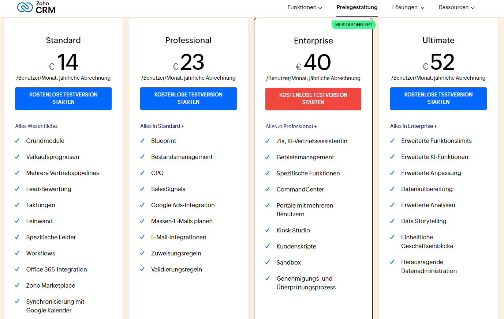

---
### 2. **Salesforce Sales Cloud – Starter Suite (25€/Benutzer/Monat)**
#### **Funktionen:**
- Grundlegende CRM-Funktionen:
  - Verwaltung von Leads, Kontakten, Accounts und Opportunities.
  - Email-Integration.
  - Simplified Setup and Onboarding für einfache Nutzung.
#### **Kosten:**
- **Kosten**: 750 €/Monat
#### **Begründung:**
- Einsteigerfreundlich mit den wichtigsten Funktionen für CRM.
- Einfach zu implementieren und erfüllt die grundlegenden Anforderungen.
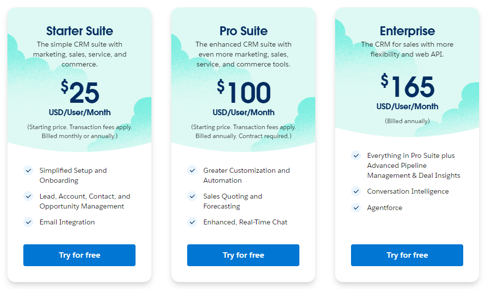

---
# Interpretation der Resultate

## 1. Kostenvergleich der verschiedenen Lösungen

### AWS
**Gesamtkosten:** $239.18/Monat  
**Warum so hoch?**  
AWS bietet eine sehr leistungsstarke Infrastruktur mit schnellen SSD-Speichern und skalierbaren Ressourcen, was die hohen Kosten rechtfertigt. Die t3.medium-Instanz für den Datenbankserver und der S3-Backup-Service bieten eine hohe Leistung und Redundanz, was jedoch auch zu höheren monatlichen Ausgaben führt. Die hohen Kosten spiegeln sich in der Flexibilität und Skalierbarkeit wider, die AWS bietet.

### Azure
**Gesamtkosten:** $112.46/Monat  
**Warum günstiger?**  
Azure bietet eine kostengünstigere Lösung, da der Webserver (B1ms) und der Datenbankserver (B2ms) niedrigere Spezifikationen haben als ihre AWS-Pendants. Zudem wird für den Backup-Speicher ein kostengünstigerer Block Blob Storage verwendet, während AWS teureres S3 Standard verwendet. Azure ist ideal für kleinere bis mittlere Workloads und bietet eine gute Balance zwischen Preis und Leistung.

### Heroku (PaaS)
**Gesamtkosten:** $110/Monat  
**Warum so günstig?**  
Heroku bietet eine Plattform als Service (PaaS), die den Aufwand für Infrastrukturmanagement reduziert. Die Nutzung von standardisierten Webserver- und Datenbanktarifen für kleine Anwendungen macht die Lösung kostengünstig. Die Skalierbarkeit ist jedoch eingeschränkt im Vergleich zu AWS und Azure, was bedeutet, dass die Lösung eher für kleinere Anwendungen geeignet ist. Heroku übernimmt viele Verwaltungsaufgaben, was den Betrieb günstiger macht.

### Zoho CRM (SaaS)
**Gesamtkosten:** 690 €/Monat  
**Warum so hoch?**  
Zoho CRM bietet eine umfassende CRM-Plattform mit erweiterten Funktionen wie Automatisierung, Prozessmanagement und Marketing-Integration. Diese erweiterten Funktionen machen es teurer, jedoch rechtfertigen die umfassenden Automatisierungs- und Integrationsmöglichkeiten den Preis. Für Firmen, die eine starke CRM-Lösung benötigen, kann es die Investition wert sein.

### Salesforce Sales Cloud (SaaS)
**Gesamtkosten:** 750 €/Monat  
**Warum so hoch?**  
Salesforce bietet eine robuste CRM-Lösung, die insbesondere für grössere Unternehmen oder komplexe Geschäftsprozesse geeignet ist. Die Preisgestaltung liegt leicht über Zoho, bietet jedoch zusätzliche Funktionen und Integrationen, die für grössere Organisationen oder spezifische Anforderungen notwendig sein könnten. Die höheren Kosten spiegeln sich in der Funktionalität und Skalierbarkeit wider.

---

## 2. Aufwand für die Firma bei der Migration

### AWS
**Aufwand:** Hoch  
AWS erfordert umfangreiche Planung und Migration, insbesondere aufgrund der Vielzahl an Optionen, die für die Ressourcenverwaltung zur Verfügung stehen. Die Verwaltung von Instanzen, Backups und Monitoring kann komplex sein und erfordert ein gutes Verständnis von AWS-Diensten. Zudem muss die Infrastruktur regelmässig überwacht und optimiert werden, um die Kosten zu kontrollieren.

### Azure
**Aufwand:** Mittel  
Azure ist weniger komplex als AWS, bietet jedoch ähnliche Dienste. Die Migration von lokalen Servern in die Azure-Umgebung erfordert Planung und eventuell die Anpassung bestehender Anwendungen an die Cloud-Infrastruktur. Der Aufwand für Verwaltung und Skalierung ist ebenfalls hoch, jedoch gibt es viele Automatisierungstools, die den Prozess erleichtern.

### Heroku (PaaS)
**Aufwand:** Niedrig  
Heroku erfordert im Vergleich zu AWS und Azure weniger Aufwand, da die Infrastrukturverwaltung weitgehend von Heroku übernommen wird. Für die Migration ist es wichtig, bestehende Anwendungen so zu konfigurieren, dass sie mit der Heroku-Plattform kompatibel sind. Da Heroku ein PaaS-Modell bietet, kann die Migration relativ schnell und unkompliziert erfolgen, insbesondere für Webanwendungen.

### Zoho CRM (SaaS)
**Aufwand:** Niedrig  
Die Migration zu Zoho CRM ist in der Regel unkompliziert, da es sich um eine SaaS-Lösung handelt, die keine Infrastrukturverwaltung erfordert. Der Aufwand liegt hauptsächlich in der Datenmigration aus bestehenden CRM-Systemen und der Konfiguration von Funktionen wie Workflows und Automatisierungen. Zoho bietet jedoch umfangreiche Integrationsmöglichkeiten, was die Migration etwas anspruchsvoller machen kann, je nach den bestehenden Systemen.

### Salesforce Sales Cloud (SaaS)
**Aufwand:** Mittel bis hoch  
Die Migration zu Salesforce kann mehr Aufwand erfordern, insbesondere bei der Integration mit bestehenden Systemen. Die Salesforce-Plattform bietet viele Anpassungsmöglichkeiten, was den Aufwand für die Migration erhöht, da alle Geschäftsprozesse angepasst und migriert werden müssen. Allerdings bietet Salesforce auch umfassende Tools und Unterstützung, um den Migrationsprozess zu erleichtern.

---

## 3. Fazit

### Kosten:
- **AWS** ist am teuersten, bietet aber auch die beste Leistung und Flexibilität für komplexe Anwendungen.
- **Azure** bietet ein gutes Preis-Leistungs-Verhältnis für Unternehmen mit moderaten Anforderungen.
- **Heroku** ist am kostengünstigsten und eignet sich besonders für einfache Webanwendungen.
- **Zoho CRM** und **Salesforce** sind SaaS-Lösungen, die in Bezug auf Kosten und Funktionalität stark variieren. Sie sind teurer als Infrastrukturlösungen, bieten jedoch eine sehr schnelle Implementierung und minimalen Wartungsaufwand.

### Aufwand für die Firma:
- **AWS** und **Azure** erfordern den grössten Aufwand für die Migration und Verwaltung, insbesondere aufgrund der Komplexität der Cloud-Infrastruktur.
- **Heroku** erfordert den geringsten Aufwand und bietet eine schnelle Möglichkeit, Webanwendungen in die Cloud zu migrieren.
- **Zoho CRM** und **Salesforce** sind ebenfalls SaaS-Lösungen, die eine schnelle Implementierung ermöglichen, jedoch mehr Aufwand bei der Datenmigration und Integration mit bestehenden Systemen verursachen können.

### Gerechtfertigte Kosten:
- Die höheren Kosten von **AWS** und **Salesforce** sind gerechtfertigt, wenn man die umfangreiche Funktionalität, Skalierbarkeit und Flexibilität berücksichtigt.
- **Azure** und **Heroku** bieten eine kostengünstigere Lösung für kleinere bis mittlere Anwendungen.
- **Zoho CRM** und **Salesforce** bieten wertvolle Automatisierungs- und Integrationsfunktionen, was die höheren Kosten in vielen Fällen rechtfertigt, insbesondere für grössere Unternehmen oder komplexe Geschäftsprozesse.

### Gesamtfazit:
Insgesamt hängt die Wahl der richtigen Lösung von den spezifischen Anforderungen der Firma ab, sowohl hinsichtlich der benötigten Funktionen als auch des Budgets und des Migrationsaufwands.